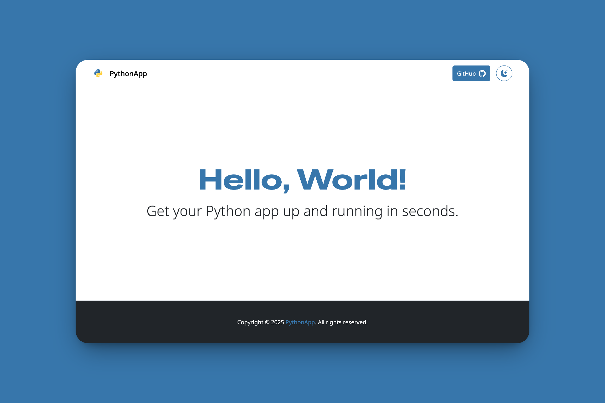

# FlaskApp

## Overview

This project is a simple [Flask](https://flask.palletsprojects.com) application that serves as a template for building web applications. It includes a basic structure with Docker support for easy deployment and development.

## Prerequisites

> [!IMPORTANT]
>
> - Docker
> - Docker Compose

## User Interface (UI)

| <a href="https://www.robertovicario.com/FlaskApp"></a> |
| :-: |
| **Home - FlaskApp** |

## Instructions

Usage:

```sh
bash cmd.sh {start|stop|build|clear}
```

### `build`

If you haven't built the project yet, you can do so by running:

```sh
bash cmd.sh build
```

To run in detached mode, use:

```sh
bash cmd.sh build -d
```

Once the build process is complete, the project will be accessible at `localhost:8000`.

> [!WARNING]
>
> If this port is already in use, search for all occurrences of `8000` within the project and replace them with your preferred port number. After making these changes, you'll need to rebuild the project for the modifications to take effect.

### `start`

The program will run in debug mode, meaning frontend changes will be rendered upon reload. However, if you make changes to the backend, you will need to restart the program by running:

```sh
bash cmd.sh start
```

To run in detached mode, use:

```sh
bash cmd.sh start -d
```

### `stop`

To stop the program, simply run:

```sh
bash cmd.sh stop
```

> [!TIP]  
> For a quicker way to stop, use `ctrl + C` to force stop the program.

### `clear`

If you need to clear all containers and their orphaned dependencies, you can run:

```sh
bash cmd.sh clear
```

### `deploy`

To deploy the application to production, you can use the following command:

```sh
bash cmd.sh deploy
```

This project leverages GitHub Actions for CI/CD. The deployment workflow is configured to automatically build the project and deploy it to the GitHub Pages environment.

## License

This project is distributed under [GNU General Public License version 3](https://opensource.org/license/gpl-3-0). You can find the complete text of the license in the project repository.
